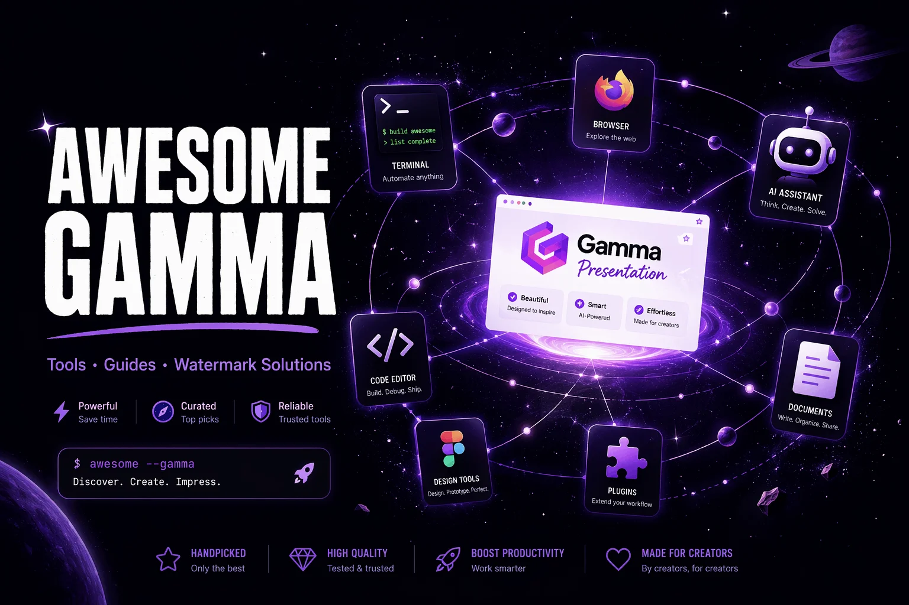

# Awesome Gamma 

> Curated tools, guides, templates, export utilities, watermark solutions, and alternatives for [Gamma.app](https://gamma.app) users.

Gamma is an AI tool that generates presentations, documents, and websites from prompts. This list collects the practical resources around it — the export tricks, the watermark answers, the automation hooks, and the honest alternatives — that Gamma's own documentation does not cover in one place.

Contributions are welcome; see [Contributing](#contributing).

## Contents

- [Official Resources](#official-resources)
- [Export Tools & Guides](#export-tools--guides)
- [Watermark Tools](#watermark-tools)
- [Presentation Templates](#presentation-templates)
- [Gamma Alternatives](#gamma-alternatives)
- [Automation, MCP & AI Agents](#automation-mcp--ai-agents)
- [Tutorials & Articles](#tutorials--articles)
- [FAQ](#faq)
- [Contributing](#contributing)

## Official Resources

- [Gamma.app](https://gamma.app) — the product itself
- [Gamma Help Center](https://help.gamma.app) — official documentation
- [How do credits work in Gamma?](https://help.gamma.app/en/articles/7834324-how-do-credits-work-in-gamma) — the official credit mechanics (free plan: 400 lifetime credits)
- [What's the easiest way to export my Gamma?](https://help.gamma.app/en/articles/8022861-what-s-the-easiest-way-to-export-my-gamma) — official export documentation (PDF / PPTX / web)
- [Gamma Pricing](https://gamma.app/pricing) — Free / Plus / Team / Enterprise tiers

## Export Tools & Guides

- [How to Export from Gamma Without Branding](https://gammaremover.com/en/blog/how-to-export-gamma-without-branding/) — what each plan's exports contain and how to get clean output
- [Gamma Free Plan: Credits, Watermark & Limits](https://gammaremover.com/en/blog/gamma-free-plan-limits-2026/) — how the 400 lifetime credits actually work in practice
- [Gamma Free Plan 2026 workarounds](https://www.slidegmm.ai/en/blog/gamma-free-tier-limits-2026-workarounds) — third-party breakdown of free-tier limits
- **PowerPoint Slide Master** — Gamma stores export branding on the slide layouts/masters; View → Slide Master in PowerPoint exposes it for manual editing

## Watermark Tools

Free-tier exports carry a "Made with Gamma" badge on every page and slide. Ways to handle it, grouped by approach:

### Browser-based (no install)

- [GammaRemover](https://gammaremover.com) — free; runs entirely in the browser via WebAssembly (no upload, no signup); removes the badge object losslessly from PDF and PPTX. Dedicated flows for [PDF](https://gammaremover.com/en/pdf/) and [PPTX](https://gammaremover.com/en/pptx/)
- [Pixelbin](https://www.pixelbin.io/blog/how-to-remove-gamma-watermark) — AI-based watermark removal for PDFs (upload required, free tier limited to a few files per month)

### CLI / Python / local

- [gammaremover/gamma-watermark-remover](https://github.com/gammaremover/gamma-watermark-remover) — `pip install gamma-watermark-remover`; CLI + library (pypdf / python-pptx), batch support, tests, MIT
- [gammaremover/gamma-watermark-remover-webui](https://github.com/gammaremover/gamma-watermark-remover-webui) — local drag-and-drop web UI on localhost; files stay on your machine
- [DedInc/gamma-ai-watermark-remover](https://github.com/DedInc/gamma-ai-watermark-remover) — local FastAPI web tool; also handles Keynote and PNG ZIP exports
- [K0STEP/gamma_watermark_remover](https://github.com/K0STEP/gamma_watermark_remover) — no-dependency Python script for PDFs
- [Aditya-233/Gamma-Watermark-Remover](https://github.com/Aditya-233/Gamma-Watermark-Remover) — FastAPI-based PDF/PPTX utility
- [TanujairamV/watermark-remover](https://github.com/TanujairamV/watermark-remover) — web application targeting Gamma PDF branding

### Manual methods

- **Slide Master editing** (PPTX) — delete the badge from the master/layouts once, it disappears from every slide; free and lossless
- **Canva / Google Slides import** — import the PPTX and delete the badge per slide; watch for font and layout shifts
- [Five free methods compared](https://gammaremover.com/en/blog/remove-gamma-watermark-without-upgrading/) — honest comparison table (speed / quality / effort)

### Official route

- **Gamma Plus** removes the watermark from *new* exports. It does not clean files already exported — [what actually happens after upgrading](https://gammaremover.com/en/blog/does-gamma-plus-remove-watermark/)

## Presentation Templates

- [Gamma template gallery](https://gamma.app/templates) — official starting points
- [Slidesgo](https://slidesgo.com) — large library of free PowerPoint / Google Slides templates (useful when rebuilding a deck outside Gamma)
- [SlidesCarnival](https://www.slidescarnival.com) — free templates, no watermark
- [Presentation Go](https://www.presentationgo.com) — free charts, diagrams and layout elements

## Gamma Alternatives

Tools people weigh against Gamma, with different watermark/pricing tradeoffs:

- [Google Slides](https://slides.google.com) — free, collaborative, no export watermark; no built-in AI generation
- [Canva](https://canva.com) — free tier with huge template library; AI features on paid plans
- [Beautiful.ai](https://beautiful.ai) — design-automation focus, trial-based
- [Tome](https://tome.app) — AI-native storytelling format
- [Decktopus](https://www.decktopus.com) — AI deck generation at lower price points
- [Comparison: Gamma vs Canva vs Google Slides](https://gammaremover.com/en/blog/gamma-vs-canva-vs-google-slides-watermark/) — export and watermark behavior side by side
- [Best free presentation tools without watermarks](https://gammaremover.com/en/blog/best-free-presentation-tools-no-watermark/)

## Automation, MCP & AI Agents

- [gamma-watermark-remover-mcp](https://github.com/gammaremover/gamma-watermark-remover-mcp) — MCP server so Claude Desktop / Claude Code / any MCP client can clean Gamma exports; local stdio or hosted endpoint
- [gamma-watermark-remover-skill](https://github.com/gammaremover/gamma-watermark-remover-skill) — agent skill for Claude Code and OpenClaw
- [Model Context Protocol](https://modelcontextprotocol.io) — the open protocol for exposing tools to AI assistants
- [python-pptx](https://github.com/scanny/python-pptx) — the Python library for programmatic PowerPoint editing (what most PPTX tooling here is built on)
- [pypdf](https://github.com/py-pdf/pypdf) — pure-Python PDF manipulation

## Tutorials & Articles

- [What Is a Gamma Watermark Remover and How Does It Work?](https://gammaremover.com/en/blog/what-is-gamma-watermark-remover/) — how the badge is stored inside exports
- [How to Remove Gamma Watermark from PPT: 2026 Guide](https://www.pdnob.com/pdf-tips/how-to-remove-gamma-watermark-from-ppt.html) — editor-based walkthrough
- [Remove Gamma Watermark: 3 Ways](https://www.slidegmm.ai/en/compare/gamma-watermark-removal-guide) — free and paid routes compared
- [How to remove the Gamma watermark on iPhone and Android](https://gammaremover.com/en/blog/remove-gamma-watermark-on-mobile/) — mobile browser workflow
- [Is It Safe to Remove the Gamma Watermark?](https://gammaremover.com/en/blog/is-it-safe-to-remove-gamma-watermark/) — privacy, quality and rules
- [Gamma Free vs Pro: Is It Worth Paying?](https://gammaremover.com/en/blog/gamma-free-vs-pro-watermark/) — when upgrading genuinely makes sense

## FAQ

**Does Gamma's free plan watermark everything?**
Web shares, PDF exports, and PPTX exports all carry the "Made with Gamma" badge on the free plan. Paid plans remove it from new exports.

**Do credits refresh monthly on the free plan?**
No — the 400 credits are a lifetime allowance. Referrals add a limited bonus; otherwise the meter only goes down.

**Where exactly is the watermark stored?**
In PDFs: a small image in the bottom-right of each page plus a gamma.app link annotation. In PPTX: a hyperlinked shape on the slide master/layouts. Because it is a discrete object, structural removal is possible without touching the rest of the file.

**Does upgrading clean files I already exported?**
No. Upgrading affects future exports only; existing files keep their badge unless cleaned at the file level.

## Contributing

Additions welcome — tools, guides, templates, or articles that are genuinely useful to Gamma users. One line per entry with a short factual description. No affiliate links, no pure marketing pages. Open a pull request.

## License

[CC0](LICENSE) — public domain.
